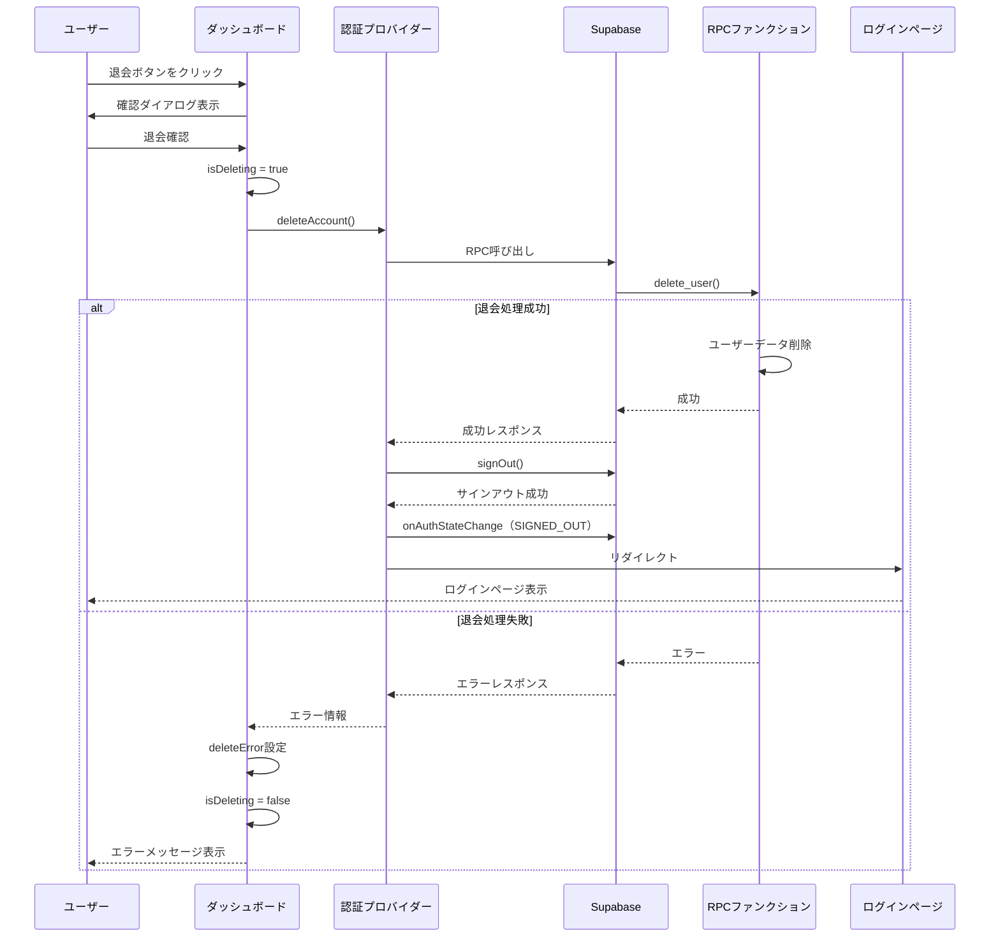

```mermaid
sequenceDiagram
    participant User as ユーザー
    participant Dashboard as ダッシュボード
    participant AuthProvider as 認証プロバイダー
    participant Supabase as Supabase
    participant RPC as RPCファンクション
    participant LoginPage as ログインページ
    
    User->>Dashboard: 退会ボタンをクリック
    Dashboard->>User: 確認ダイアログ表示
    User->>Dashboard: 退会確認
    Dashboard->>Dashboard: isDeleting = true
    Dashboard->>AuthProvider: deleteAccount()
    AuthProvider->>Supabase: RPC呼び出し
    Supabase->>RPC: delete_user()
    
    alt 退会処理成功
        RPC->>RPC: ユーザーデータ削除
        RPC-->>Supabase: 成功
        Supabase-->>AuthProvider: 成功レスポンス
        AuthProvider->>Supabase: signOut()
        Supabase-->>AuthProvider: サインアウト成功
        AuthProvider->>Supabase: onAuthStateChange（SIGNED_OUT）
        AuthProvider->>LoginPage: リダイレクト
        LoginPage-->>User: ログインページ表示
    else 退会処理失敗
        RPC-->>Supabase: エラー
        Supabase-->>AuthProvider: エラーレスポンス
        AuthProvider-->>Dashboard: エラー情報
        Dashboard->>Dashboard: deleteError設定
        Dashboard->>Dashboard: isDeleting = false
        Dashboard-->>User: エラーメッセージ表示
    end
```