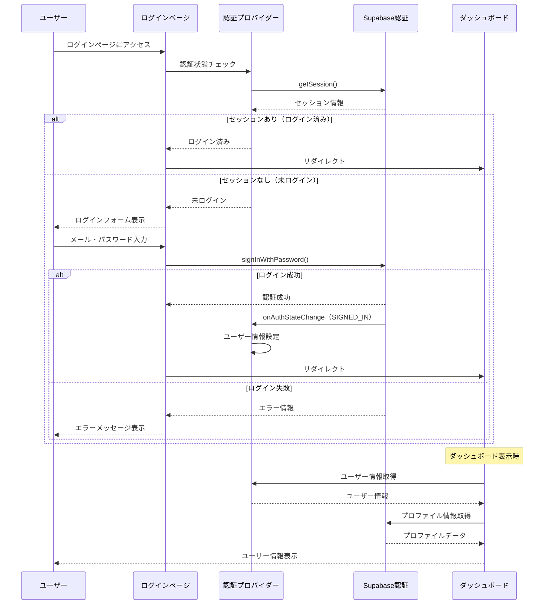

```mermaid
sequenceDiagram
    participant User as ユーザー
    participant LoginPage as ログインページ
    participant AuthProvider as 認証プロバイダー
    participant Supabase as Supabase認証
    participant Dashboard as ダッシュボード
    
    User->>LoginPage: ログインページにアクセス
    LoginPage->>AuthProvider: 認証状態チェック
    AuthProvider->>Supabase: getSession()
    Supabase-->>AuthProvider: セッション情報
    
    alt セッションあり（ログイン済み）
        AuthProvider-->>LoginPage: ログイン済み
        LoginPage->>Dashboard: リダイレクト
    else セッションなし（未ログイン）
        AuthProvider-->>LoginPage: 未ログイン
        LoginPage-->>User: ログインフォーム表示
        User->>LoginPage: メール・パスワード入力
        LoginPage->>Supabase: signInWithPassword()
        
        alt ログイン成功
            Supabase-->>LoginPage: 認証成功
            Supabase->>AuthProvider: onAuthStateChange（SIGNED_IN）
            AuthProvider->>AuthProvider: ユーザー情報設定
            LoginPage->>Dashboard: リダイレクト
        else ログイン失敗
            Supabase-->>LoginPage: エラー情報
            LoginPage-->>User: エラーメッセージ表示
        end
    end
    
    note over Dashboard: ダッシュボード表示時
    Dashboard->>AuthProvider: ユーザー情報取得
    AuthProvider-->>Dashboard: ユーザー情報
    Dashboard->>Supabase: プロファイル情報取得
    Supabase-->>Dashboard: プロファイルデータ
    Dashboard-->>User: ユーザー情報表示
```