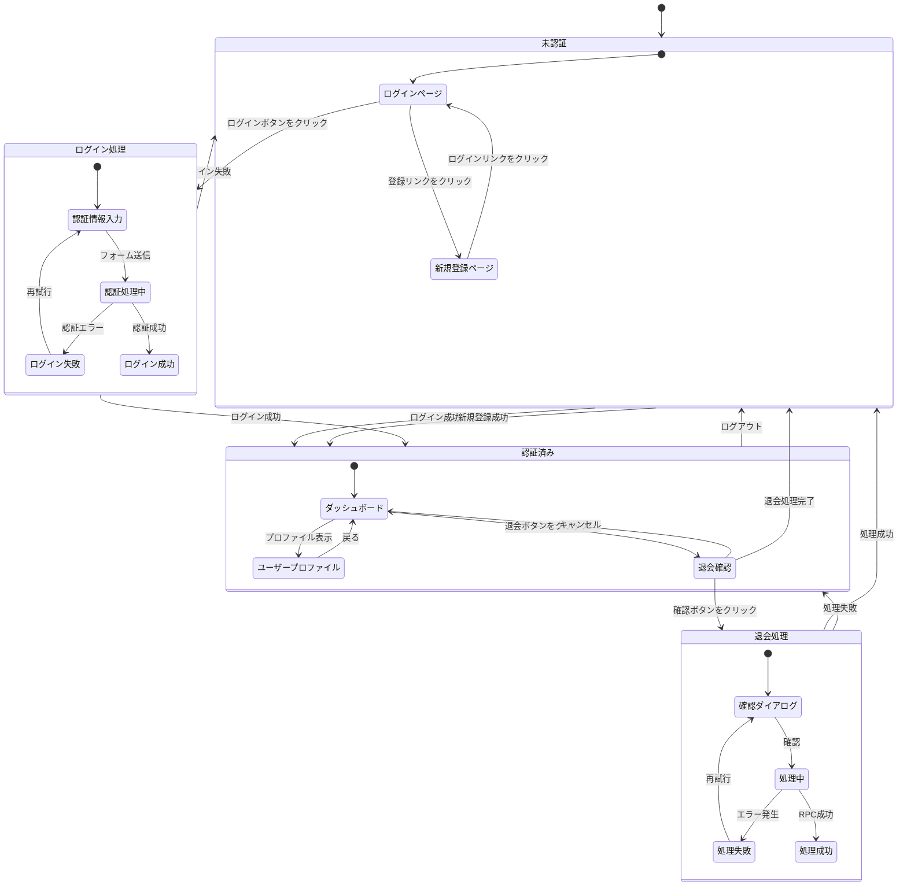

```mermaid
stateDiagram-v2
    [*] --> 未認証
    
    state 未認証 {
        [*] --> ログインページ
        ログインページ --> 新規登録ページ: 登録リンクをクリック
        新規登録ページ --> ログインページ: ログインリンクをクリック
    }
    
    state 認証済み {
        [*] --> ダッシュボード
        ダッシュボード --> ユーザープロファイル: プロファイル表示
        ユーザープロファイル --> ダッシュボード: 戻る
        ダッシュボード --> 退会確認: 退会ボタンをクリック
        退会確認 --> ダッシュボード: キャンセル
    }
    
    未認証 --> 認証済み: ログイン成功
    未認証 --> 認証済み: 新規登録成功
    認証済み --> 未認証: ログアウト
    退会確認 --> 未認証: 退会処理完了
    
    state ログイン処理 {
        [*] --> 認証情報入力
        認証情報入力 --> 認証処理中: フォーム送信
        認証処理中 --> ログイン失敗: 認証エラー
        認証処理中 --> ログイン成功: 認証成功
        ログイン失敗 --> 認証情報入力: 再試行
    }
    
    state 退会処理 {
        [*] --> 確認ダイアログ
        確認ダイアログ --> 処理中: 確認
        処理中 --> 処理失敗: エラー発生
        処理中 --> 処理成功: RPC成功
        処理失敗 --> 確認ダイアログ: 再試行
    }
    
    ログインページ --> ログイン処理: ログインボタンをクリック
    ログイン処理 --> 認証済み: ログイン成功
    ログイン処理 --> 未認証: ログイン失敗
    
    退会確認 --> 退会処理: 確認ボタンをクリック
    退会処理 --> 未認証: 処理成功
    退会処理 --> 認証済み: 処理失敗
```