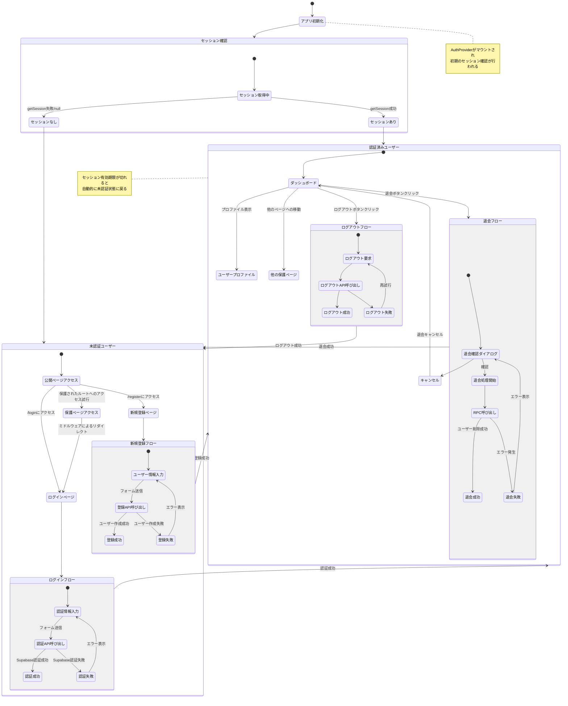

```mermaid
stateDiagram-v2
    [*] --> アプリ初期化
    
    アプリ初期化 --> セッション確認
    
    state セッション確認 {
        [*] --> セッション取得中
        セッション取得中 --> セッションあり: getSession成功
        セッション取得中 --> セッションなし: getSession失敗/null
    }
    
    セッションなし --> 未認証ユーザー
    セッションあり --> 認証済みユーザー
    
    state 未認証ユーザー {
        [*] --> 公開ページアクセス
        公開ページアクセス --> ログインページ: /loginにアクセス
        公開ページアクセス --> 新規登録ページ: /registerにアクセス
        公開ページアクセス --> 保護ページアクセス: 保護されたルートへのアクセス試行
        保護ページアクセス --> ログインページ: ミドルウェアによるリダイレクト
        
        state ログインフロー {
            [*] --> 認証情報入力
            認証情報入力 --> 認証API呼び出し: フォーム送信
            認証API呼び出し --> 認証成功: Supabase認証成功
            認証API呼び出し --> 認証失敗: Supabase認証失敗
            認証失敗 --> 認証情報入力: エラー表示
        }
        
        state 新規登録フロー {
            [*] --> ユーザー情報入力
            ユーザー情報入力 --> 登録API呼び出し: フォーム送信
            登録API呼び出し --> 登録成功: ユーザー作成成功
            登録API呼び出し --> 登録失敗: ユーザー作成失敗
            登録失敗 --> ユーザー情報入力: エラー表示
        }
        
        ログインページ --> ログインフロー
        新規登録ページ --> 新規登録フロー
    }
    
    state 認証済みユーザー {
        [*] --> ダッシュボード
        ダッシュボード --> ユーザープロファイル: プロファイル表示
        ダッシュボード --> 他の保護ページ: 他のページへの移動
        
        state ログアウトフロー {
            [*] --> ログアウト要求
            ログアウト要求 --> ログアウトAPI呼び出し
            ログアウトAPI呼び出し --> ログアウト成功
            ログアウトAPI呼び出し --> ログアウト失敗
            ログアウト失敗 --> ログアウト要求: 再試行
        }
        
        state 退会フロー {
            [*] --> 退会確認ダイアログ
            退会確認ダイアログ --> キャンセル
            退会確認ダイアログ --> 退会処理開始: 確認
            退会処理開始 --> RPC呼び出し
            RPC呼び出し --> 退会成功: ユーザー削除成功
            RPC呼び出し --> 退会失敗: エラー発生
            退会失敗 --> 退会確認ダイアログ: エラー表示
        }
        
        ダッシュボード --> ログアウトフロー: ログアウトボタンクリック
        ダッシュボード --> 退会フロー: 退会ボタンクリック
        キャンセル --> ダッシュボード: 退会キャンセル
    }
    
    ログインフロー --> 認証済みユーザー: 認証成功
    新規登録フロー --> 認証済みユーザー: 登録成功
    ログアウトフロー --> 未認証ユーザー: ログアウト成功
    退会フロー --> 未認証ユーザー: 退会成功
    
    note right of アプリ初期化
        AuthProviderがマウントされ
        初期のセッション確認が行われる
    end note
    
    note right of 認証済みユーザー
        セッション有効期限が切れると
        自動的に未認証状態に戻る
    end note
```