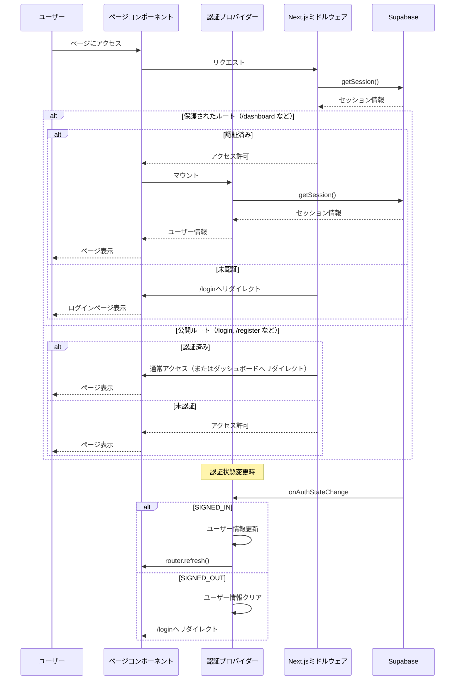

```mermaid
sequenceDiagram
    participant User as ユーザー
    participant Pages as ページコンポーネント
    participant AuthProvider as 認証プロバイダー
    participant Middleware as Next.jsミドルウェア
    participant Supabase as Supabase
    
    User->>Pages: ページにアクセス
    Pages->>Middleware: リクエスト
    Middleware->>Supabase: getSession()
    Supabase-->>Middleware: セッション情報
    
    alt 保護されたルート（/dashboard など）
        alt 認証済み
            Middleware-->>Pages: アクセス許可
            Pages->>AuthProvider: マウント
            AuthProvider->>Supabase: getSession()
            Supabase-->>AuthProvider: セッション情報
            AuthProvider-->>Pages: ユーザー情報
            Pages-->>User: ページ表示
        else 未認証
            Middleware->>Pages: /loginへリダイレクト
            Pages-->>User: ログインページ表示
        end
    else 公開ルート（/login, /register など）
        alt 認証済み
            Middleware->>Pages: 通常アクセス（またはダッシュボードへリダイレクト）
            Pages-->>User: ページ表示
        else 未認証
            Middleware-->>Pages: アクセス許可
            Pages-->>User: ページ表示
        end
    end
    
    note over AuthProvider: 認証状態変更時
    Supabase->>AuthProvider: onAuthStateChange
    
    alt SIGNED_IN
        AuthProvider->>AuthProvider: ユーザー情報更新
        AuthProvider->>Pages: router.refresh()
    else SIGNED_OUT
        AuthProvider->>AuthProvider: ユーザー情報クリア
        AuthProvider->>Pages: /loginへリダイレクト
    end
```